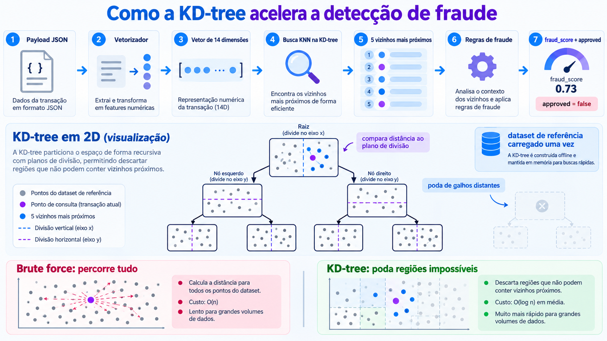

# Rinha de Backend 2026 – Fraud Detection


[Português](#português) · [English](#english)

### Edição encerrada! Resultados oficiais em [rinhadebackend.com.br](https://rinhadebackend.com.br/) · Edition closed! Official results at [rinhadebackend.com.br](https://rinhadebackend.com.br/)

---

## Português

A **Rinha de Backend** é uma competição amistosa em que você constrói um backend sob restrições de CPU, memória, e arquitetura. Cada edição traz um tema diferente – e o desta vez é **detecção de fraudes usando busca vetorial**.

**Documentação completa do desafio:** [**docs/br/README.md**](./docs/br/README.md)

### Como a detecção funciona

Para cada requisição, transformamos a payload em um vetor numérico de 14
dimensões. Não é um embedding de IA: são cálculos determinísticos baseados nos
campos da transação.

```text
payload JSON
   ↓
vetorização matemática
   ↓
[14 números]
   ↓
comparação com o dataset
   ↓
5 vizinhos mais próximos
   ↓
fraud_score e approved
```



O diagrama abaixo mostra como a KD-tree evita comparar a transação com todas as
referências quando consegue descartar regiões que não podem conter vizinhos
mais próximos.

O vetor novo é comparado com o dataset de referências. Quanto menor a distância
euclidiana, mais parecidas são as transações. O resultado usa a regra:

```text
fraud_score = quantidade de vizinhos fraud / 5
approved = fraud_score < 0.6
```

### Mapa das otimizações usadas

| Item visto no ranking | Como está no projeto | Onde conferir |
| --- | --- | --- |
| Go 1.26 | adotado na toolchain e no módulo | [`Dockerfile`](./Dockerfile), [`go.mod`](./go.mod) |
| `GOEXPERIMENT=simd` / `archsimd` | kernel SIMD para a distância quantizada, com fallback escalar | [`distance_simd.go`](./internal/dataset/distance_simd.go), [`distance_scalar.go`](./internal/dataset/distance_scalar.go) |
| AVX2 | `GOAMD64=v3` no build; v3 exige suporte AVX2 | [`Dockerfile`](./Dockerfile) |
| Linux epoll | usado automaticamente pelo netpoller do `net/http` no Linux; não há código epoll manual | [`handler.go`](./internal/http/handler.go) |
| no-cgo | `CGO_ENABLED=0` e imagem final `scratch` | [`Dockerfile`](./Dockerfile) |
| no-framework | HTTP com a biblioteca padrão do Go, sem dependências externas | [`routes.go`](./internal/http/routes.go), [`go.mod`](./go.mod) |
| P lógico por API | `GOMAXPROCS=1` nas duas instâncias limitadas a `0,25 CPU` | [`docker-compose.yml`](./docker-compose.yml) |

O SIMD foi limitado a operações de 128 bits para manter compatibilidade com
CPU AVX2; uma tentativa com vetores maiores gerou instruções AVX-512 e foi
descartada. O arquivo escalar continua sendo o fallback quando a aplicação é
compilada sem `GOEXPERIMENT=simd`.

### Case de sucesso: transação aprovada

Uma compra de baixo valor, próxima de casa e em um comerciante conhecido:

```bash
curl -i -X POST http://localhost:9999/fraud-score \
  -H 'Content-Type: application/json' \
  --data-raw '{
    "id": "tx-approved-example",
    "transaction": {
      "amount": 41.12,
      "installments": 2,
      "requested_at": "2026-03-11T18:45:53Z"
    },
    "customer": {
      "avg_amount": 82.24,
      "tx_count_24h": 3,
      "known_merchants": ["MERC-003", "MERC-016"]
    },
    "merchant": {
      "id": "MERC-016",
      "mcc": "5411",
      "avg_amount": 60.25
    },
    "terminal": {
      "is_online": false,
      "card_present": true,
      "km_from_home": 29.23
    },
    "last_transaction": null
  }'
```

Vetor gerado:

```text
[0.0041, 0.1667, 0.0500, 0.7826, 0.3333, -1, -1,
 0.0292, 0.1500, 0, 1, 0, 0.1500, 0.0060]
```

Os cinco vizinhos mais próximos são legítimos:

```text
0.0340 legit   0.0488 legit   0.0509 legit
0.0591 legit   0.0592 legit
```

```json
{
  "approved": true,
  "fraud_score": 0.0
}
```

### Case de falha: transação negada

Aqui temos uma compra de valor alto, distante de casa e em um comerciante
desconhecido:

```bash
curl -i -X POST http://localhost:9999/fraud-score \
  -H 'Content-Type: application/json' \
  --data-raw '{
    "id": "tx-denied-example",
    "transaction": {
      "amount": 9505.97,
      "installments": 10,
      "requested_at": "2026-03-14T05:15:12Z"
    },
    "customer": {
      "avg_amount": 81.28,
      "tx_count_24h": 20,
      "known_merchants": ["MERC-008", "MERC-007", "MERC-005"]
    },
    "merchant": {
      "id": "MERC-068",
      "mcc": "7802",
      "avg_amount": 54.86
    },
    "terminal": {
      "is_online": false,
      "card_present": true,
      "km_from_home": 952.27
    },
    "last_transaction": null
  }'
```

Vetor gerado:

```text
[0.9506, 0.8333, 1.0000, 0.2174, 0.8333, -1, -1,
 0.9523, 1.0000, 0, 1, 1, 0.7500, 0.0055]
```

Os cinco vizinhos mais próximos são fraudulentos:

```text
0.2315 fraud   0.2384 fraud   0.2552 fraud
0.2667 fraud   0.2785 fraud
```

```json
{
  "approved": false,
  "fraud_score": 1.0
}
```

### Como executar localmente

Suba o Nginx e as duas instâncias da API:

```bash
docker compose up --build -d
```

Verifique a prontidão. Durante os primeiros segundos o dataset ainda pode estar
sendo carregado:

```bash
curl -i http://localhost:9999/ready
```

Quando estiver pronto, a resposta será `HTTP 200` com `ready`.

#### Testes, benchmark e carga

Como o Go é executado dentro do Docker neste projeto:

```bash
docker run --rm -e GOEXPERIMENT=simd -e GOAMD64=v3 \
  -v "$PWD":/src -w /src golang:1.26 go test ./...
docker run --rm -e GOEXPERIMENT=simd -e GOAMD64=v3 \
  -v "$PWD":/src -w /src golang:1.26 go vet ./...
```

Benchmark da busca com o dataset oficial:

```bash
docker run --rm -e GOEXPERIMENT=simd -e GOAMD64=v3 \
  -v "$PWD":/src -w /src golang:1.26 \
  go test ./internal/search -run '^$' \
  -bench '^Benchmark(BruteForce|KDTree)TopKOfficial$' -benchtime=1x
```

Teste de carga com p50, p95 e p99:

```bash
python3 scripts/load_test.py --requests 200 --concurrency 16
```

Logs e memória dos containers:

```bash
docker compose logs -f api-1 api-2 load-balancer
docker stats
```

Ao terminar:

```bash
docker compose down
```

### Resultados medidos e comparação com o teste oficial

Os números abaixo separam o benchmark local do **preview oficial da Rinha**. O
preview oficial é o parâmetro principal porque usa a carga, os payloads
rotulados e o cálculo de score do desafio.

#### Resultado do nosso projeto

Este é o resultado que importa para acompanhar a evolução do repositório:

| Medição local | Resultado do nosso projeto | Como foi medido |
| --- | ---: | --- |
| Testes Go | 7 pacotes aprovados | `go test ./...` dentro de `golang:1.26`, SIMD e AVX2 |
| Análise estática | aprovada | `go vet ./...` |
| Busca KNN atual | `0,59 ms/op` | KD-tree sobre 1.000.000 referências, Go 1.26 + SIMD/AVX2 |
| Busca KNN baseline | `19,93 ms/op` | brute force sobre o mesmo dataset |
| Alocações da busca | `480 B/op`, `6 allocs/op` | benchmark comparativo `Benchmark(BruteForce\|KDTree)TopKOfficial` |
| Carga HTTP atual | `486,54 req/s` | 200 requisições concorrentes pelo Nginx |
| Latência HTTP atual | p50 `1,41 ms`; p95 `275,75 ms`; p99 `390,31 ms` | cliente Python local, concorrência 16 |
| Latência HTTP baseline | p50 `704,05 ms`; p95 `1.499,67 ms`; p99 `1.798,11 ms` | brute force, mesma carga local |
| Falhas HTTP | `0/200` | 200 respostas HTTP 200 |
| Distribuição | `100/100` por instância | 100 requisições em `api-1` e 100 em `api-2` |
| Memória observada atual | aproximadamente `90–97 MiB` por API | limite configurado de `120 MiB` por instância |

#### Teste no padrão oficial da Rinha

O teste local de 200 requisições é útil para uma verificação rápida, mas não é
representativo do teste oficial. A suíte oficial usa o `k6`, envia payloads
rotulados com `expected_approved`, mede falso positivo, falso negativo e erro
HTTP, e calcula o score a partir do p99 e da taxa de falhas. Ela também usa um
cenário de chegada gradual de até `900 req/s` no preview e `1.200 req/s` no
teste completo.

Usamos os scripts oficiais do repositório da Rinha: [`test-preview.js`](https://github.com/zanfranceschi/rinha-de-backend-2026/blob/main/test/test-preview.js),
[`smoke.js`](https://github.com/zanfranceschi/rinha-de-backend-2026/blob/main/test/smoke.js)
e o cálculo de resultados em [`test/results.json`](https://github.com/zanfranceschi/rinha-de-backend-2026/tree/main/test).

O smoke test oficial passou:

- `5/5` requisições HTTP 200;
- `20/20` verificações de contrato aprovadas;
- JSON válido, `approved` booleano e `fraud_score` numérico;
- `0%` de erros HTTP.

Antes das otimizações, o preview oficial mostrou o limite real sob carga:

| Métrica oficial | Baseline |
| --- | ---: |
| Cenário | `900 req/s` por `120s` |
| p99 | `2.002,12 ms` |
| Erros HTTP/timeout | `13.147` |
| Taxa de falha | `94,0%` |
| Score calculado pelo script | `-6.000` |

Depois da KD-tree best-first com limite de `2.048` visitas, do `GOMAXPROCS=1`
por API, do ajuste do Nginx para reutilizar conexões e desligar o access log,
e do build Go 1.26 com SIMD/AVX2, reexecutamos exatamente o mesmo preview:

| Métrica oficial | Resultado final |
| --- | ---: |
| Cenário | `900 req/s` por `120s` |
| Requisições concluídas | `50.000/50.000` |
| p99 | `74,27 ms` |
| Erros HTTP/timeout | `0` |
| Taxa de falha de detecção | `14,366%` |
| Score calculado pelo script | `438,57` |

Também executamos o teste oficial completo, com a rampa máxima de `1.200
req/s`:

| Métrica oficial | Teste completo |
| --- | ---: |
| Cenário | rampa de `1` a `1.200 req/s` por `120s` |
| Requisições processadas | `71.221` |
| Iterações descartadas pelo teto de `250 VUs` | `838` |
| p99 | `275,73 ms` |
| Erros HTTP/timeout | `0` |
| Taxa de falha de detecção | `14,3988%` |
| Score calculado pelo script | `-177,04` |

Na comparação específica da troca de toolchain, o p99 do teste completo caiu
de `453,33 ms` para `275,73 ms`, uma redução de aproximadamente `39,18%`.
Comparado à execução anterior deste mesmo setup, que marcou `396,92 ms`, a
redução adicional foi de aproximadamente `30,53%`.
Como são execuções separadas em containers sob carga, pequenas oscilações são
esperadas; o critério de aceitação continua sendo o corte oficial de detecção,
os erros HTTP e o p99 medidos pelo mesmo script.

Mesmo no teste completo, a taxa de detecção ficou abaixo do corte de `15%`, o
p99 ficou abaixo do corte de `2.000 ms` e não houve erro HTTP. As iterações
descartadas são uma métrica do gerador k6 ao atingir `250 VUs`; elas não foram
contabilizadas como erro HTTP pelo cálculo oficial.

Comparação direta entre duas execuções do **mesmo preview oficial**:

| Métrica | Antes | Depois | Melhoria |
| --- | ---: | ---: | ---: |
| p99 | `2.002,12 ms` | `74,27 ms` | `96,29%` menor (`26,96x`) |
| Erros HTTP/timeout | `13.147` | `0` | eliminados |
| Falha de detecção | `94,009%` | `14,366%` | `-79,643 p.p.` |
| Score | `-6.000` | `438,57` | saiu do corte de pontuação |

Os dois cenários ficaram abaixo do corte de `15%` de falhas de detecção e sem
erro HTTP. Estas são medições oficiais reproduzidas localmente, não uma posição
no ranking público da competição.

Portanto, os resultados locais de `486,54 req/s` e p99 de `390,31 ms` continuam
úteis para feedback rápido, mas não substituem essa medição oficial.

Para reproduzir o padrão oficial sem adicionar o dataset de `23,8 MB` ao nosso
repositório, use uma cópia temporária dos testes oficiais:

```bash
git clone --depth 1 \
  https://github.com/zanfranceschi/rinha-de-backend-2026.git \
  /tmp/rinha-backend-2026-official

docker compose \
  -f /tmp/rinha-backend-2026-official/test/docker-compose.yml \
  --profile smoke run --rm k6-smoke

docker compose \
  -f /tmp/rinha-backend-2026-official/test/docker-compose.yml \
  --profile test run --rm k6
```

#### Melhoria observada com a KD-tree

Na mesma configuração de carga, o projeto passou de **19,34 req/s para
486,54 req/s**: aproximadamente **25,2 vezes mais throughput**. A latência
também caiu de forma expressiva:

| Métrica | Antes: brute force | Agora: KD-tree | Melhoria observada |
| --- | ---: | ---: | ---: |
| Throughput | `19,34 req/s` | `486,54 req/s` | `25,2x` (`+2.416%`) |
| p50 | `704,05 ms` | `1,41 ms` | `99,8%` menor |
| p95 | `1.499,67 ms` | `275,75 ms` | `81,6%` menor |
| p99 | `1.798,11 ms` | `390,31 ms` | `78,3%` menor |
| Busca KNN isolada | `19,93 ms/op` | `0,59 ms/op` | `33,8x` mais rápida |

Em resumo: antes, a busca percorria as 1.000.000 referências em todas as
requisições. Agora a KD-tree descarta regiões impossíveis e encontra os
vizinhos mais próximos em aproximadamente **0,59 ms/op**. Os números HTTP
locais podem variar conforme CPU, Docker e carga do sistema; por isso, a
comparação de performance usada como referência é a tabela do preview oficial
acima.

#### Referência do ranking oficial

| Submissão de referência | p99 | Falhas | Score |
| --- | ---: | ---: | ---: |
| 1º lugar: `rafaelcoelhox-detecta-fraude` | `0,4227 ms` | 0% | `6.000` |
| 9º lugar: `rinha-backend-2026-go` | `0,5068 ms` | 0% | `6.000` |

Os benchmarks locais medem o KNN isolado, enquanto o p99 oficial é medido pelo
ambiente da competição e inclui implementações muito otimizadas,
como índices vetoriais especializados, SIMD e servidores HTTP customizados.
Por isso, o nosso p99 local e o p99 oficial **não são uma comparação direta de
latência**; o valor oficial serve apenas como referência de objetivo.

Na prática, o resultado atual significa:

- funcionalmente, o projeto está passando nos testes unitários, no smoke oficial
  e no preview oficial;
- a memória observada ficou em aproximadamente `90–97 MiB` por API, abaixo do
  limite local de `120 MiB` por instância;
- a KD-tree já substituiu a busca por força bruta no runtime e o preview oficial
  caiu de `2.002,12 ms` para `74,27 ms` de p99.

Fonte dos resultados oficiais: [classificação final da Rinha de Backend 2026](https://rinhadebackend.com.br/).

## English

**Rinha de Backend** is a friendly competition where you build a backend under CPU, memory, and architecture constraints. Each edition has a different theme – this one is **fraud detection using vector search**.

**Full challenge documentation:** [**docs/en/README.md**](./docs/en/README.md)
